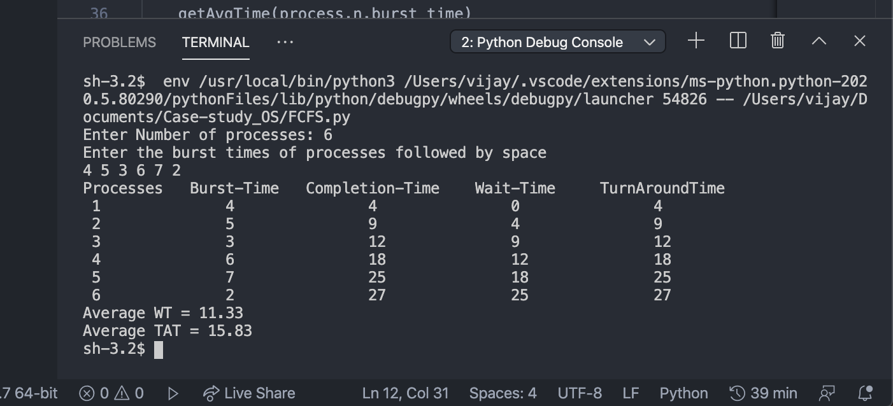
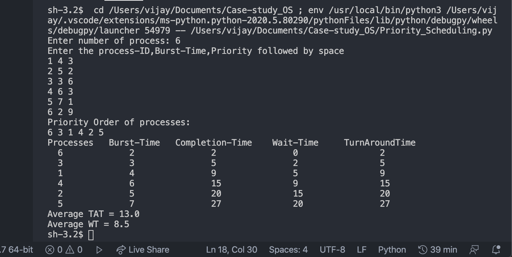
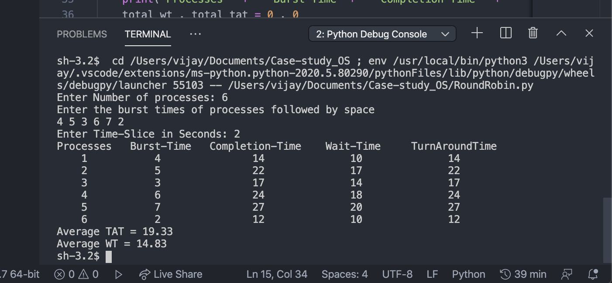

# CPU-Scheduling-Algo-s
This repo consists of CPU-Scheduling algorithms written for case-study project for OS-Lab.

Common terms used in Computation on Scheduling Algorithms:

->Completion Time: Time at which process completes its execution.

->Turn Around Time: Time Difference between completion time and arrival time. (Turn Around Time = Completion Time – Arrival Time)

->Waiting Time : Time Difference between turn around time and burst time. (Waiting Time = Turn Around Time – Burst Time)

1.) FCFS (First-Come-First-Serve):
	First in, first out (FIFO), also known as first come, first served (FCFS), is the simplest scheduling algorithm. FIFO simply queues processes in the order that they arrive in the ready queue.
In this, the process that comes first will be executed first and next process starts only after the previous gets fully executed. ( Here considering Batch arrival of processes )


For the example set , The Average Wait and TurnAroundTime are 11.33ms and 15.83ms respectively.

2.) Priority Scheduling:
	Priority scheduling is one of the most common scheduling algorithms in batch systems. Each process is assigned a priority. Process with the highest priority is to be executed first and so on.

NOTE: Processes with the same priority are executed on first come first served basis. (For Batch arrival of processes)


For the example set , The Average Wait and TurnAroundTime are 13.00ms and 8.50 ms respectively.

3.) Round Robin Scheduling:
	Round Robin Scheduling is one in which a process is executed for a fixed time slot in a cyclic fashion. This results in lower Wait-Time and Response-Time with cost of lower through-put at mid-interval time and doesn’t suffer from starvation.(Implementation on batch-processing)



The SS is taken when time-slice is set to 2ms.

4.) Multi-Level Queue Scheduling ( Non-Feedback Induced):
	A scheduling strategy where the processes are divided into n-classes and are assigned and operated on different scheduling algorithms which results in higher throughput , efficient and lower TurnaroundTime.
Is ideal when process that are running in foreground and background differ in priorities, execution-time and user-intervention times.
The version listed here utilises a modified queue implementation using FCFS , Round-Robin along with randomised selection which can improve the general implementation by huge margin in our needs.
(The work is still in progress as this involves a lot of work and time with paper implementation itself being the toughest. Current test version is submitted and improvements to be expected in future-time.

